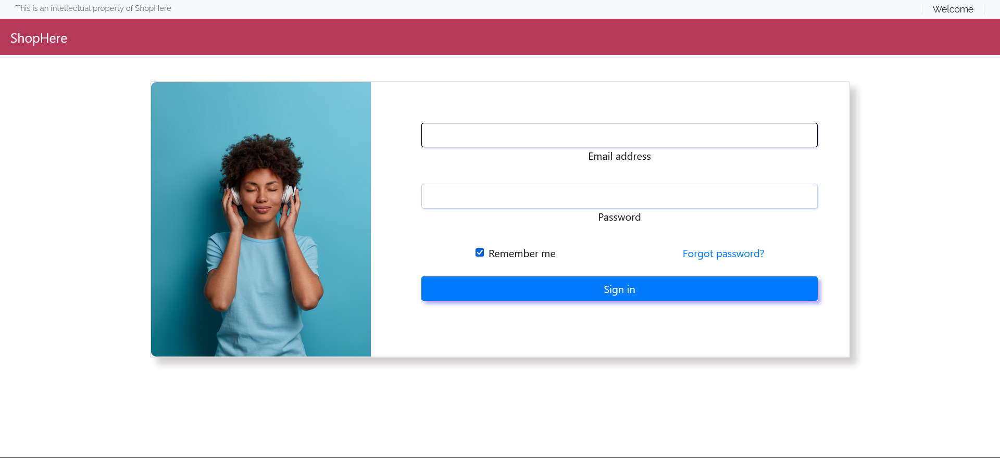
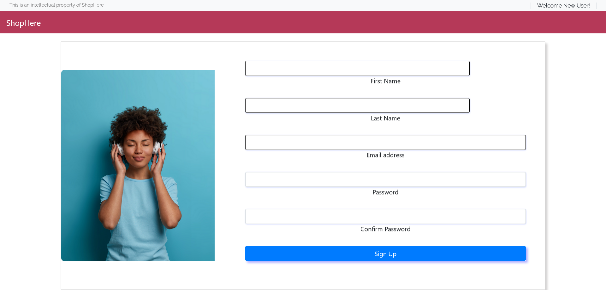
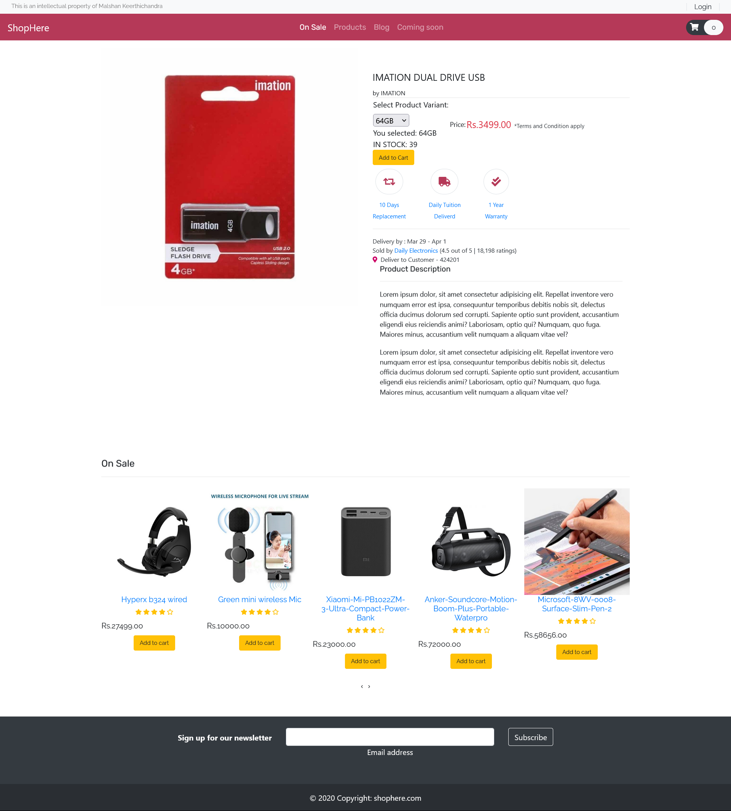
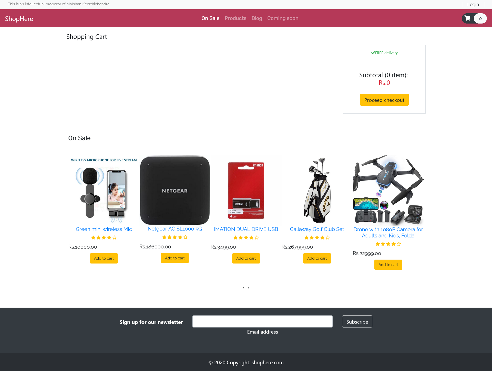

# ShopHere - Ecommerce Website
ShopHere is an Ecommerce website developed as a part of the CS3043-Database Systems module. It allows users to browse through a product catalog, sort products based on categories, login and signup, and place orders using a credit card for a given address. The website is built using HTML, Bootstrap, PHP with mysqli, JavaScript, and JQuery technologies.

# Technologies Used
1. HTML
2. Bootstrap
3. PHP with mysqli
4. JavaScript and JQuery

# Functionalities
## 1. Login and Signup
- ShopHere provides a secure login and signup system for users. New users can register by providing necessary information, and existing users can log in to access their accounts. Passwords are hashed and stored securely in the database.

### 2. Browsing Through Product Catalogue
- Users can browse through the extensive product catalog offered by ShopHere. Products are displayed in a user-friendly manner, making it easy for customers to find what they need.

### 3. Sorting Products Based on Categories
- To enhance user experience, products can be sorted based on categories. This feature allows users to quickly find products of interest without having to scroll through the entire catalog.

### 4. Real-Time Database Updates
- ShopHere uses real-time database updates to ensure that product information, stock availability, and prices remain up-to-date. This way, customers always have access to the latest product details.

### 5. Ordering Products Using a Credit Card and Address
- Customers can place orders for products they wish to purchase. The website offers a secure payment system that allows users to use their credit cards for transactions. Users can also provide a shipping address to receive the ordered products.

# Installation and Usage
To deploy ShopHere locally, follow these steps:

- Clone the repository: git clone https://github.com/malshancs/ShopHere.git
- Set up a web server using XAMPP and PHP on your machine.
- Import the database schema provided in database_schema.sql to set up the required tables and data.
- Configure the database connection in config.php with your database credentials.
- Launch the website by running it on your web server.
- Make sure to update the database credentials and other sensitive information with your own to ensure security.

# Screenshots

#### Home Page

#### Login Screen

#### Signup Screen

#### Product Catalogue screen

#### Product details screen

#### Cart screen

# License
This project is licensed under the MIT License.

# Contributing
Contributions to ShopHere are welcome! If you find any bugs, have suggestions for improvements, or want to add new features, please submit a pull request.

# Contact
For any questions or inquiries, please contact us at malshan.20@cse.mrt.ac.lk

Happy shopping with ShopHere! 🛍️
